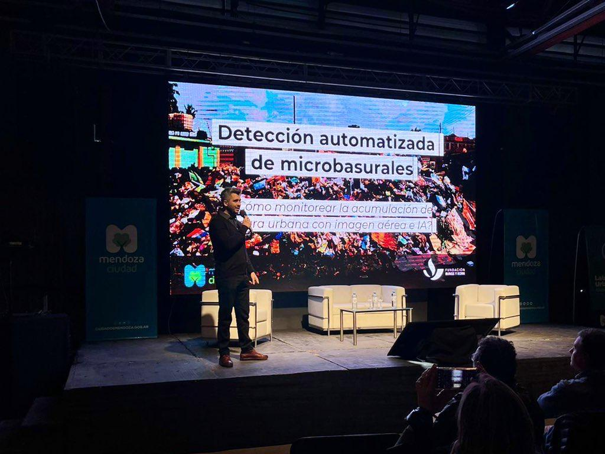
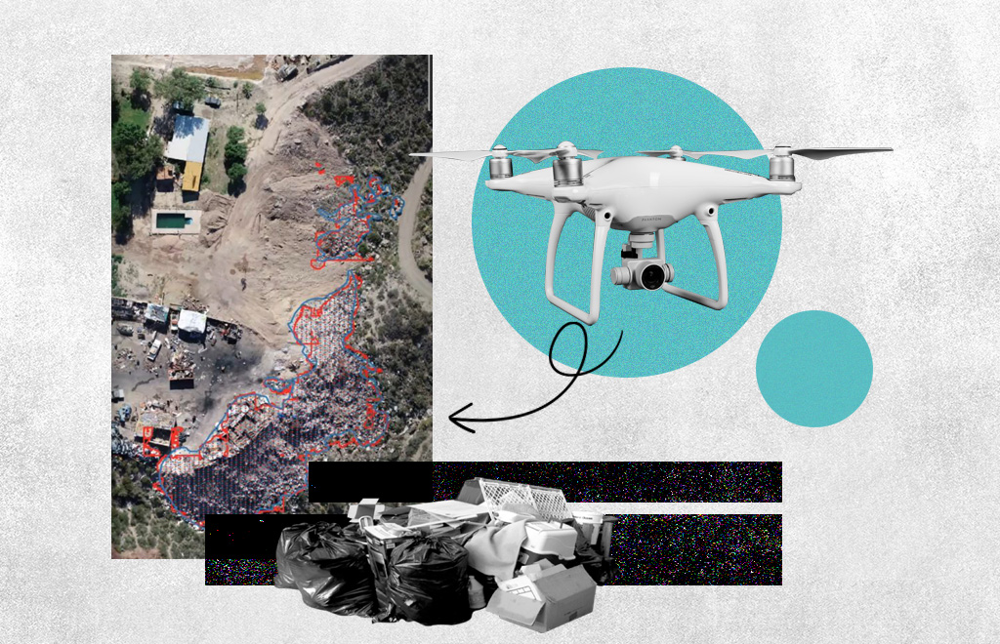
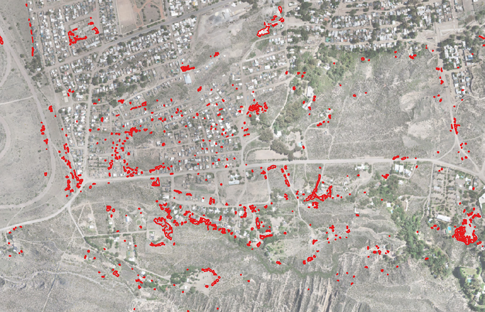

_Presenting the methodology at the Urban-Environmental Strategies Congress in Mendoza, Argentina_

In recent years, the severe social and environmental impact of illegal waste dumping sites has made them one of the most serious problems faced by cities in the Global South, in a context of scarce information available for decision-making.

With the support of the Bunge & Born Foundation, I led the development of a data-driven model combining neural network-based object detection and satellite images to help identify the location of dumping sites and track their evolution over time.

Taking advantage of the increasing availability of geospatial open data, high-resolution satellite imagery, and open-source machine learning algorithms, the automated detection model was piloted in the Greater Buenos Aires area where it helped identify more than a dozen large-scale dumping sites that were not previously registered by local experts and authorities.

_Illustration by Marisol Echarri for RED/ACCION_

Once tested, the detection methodology was refined and adapted to process ultra-high-resolution images captured by drones. This allowed its application in intra-urban contexts, where smaller-scale garbage dumps predominate and cannot be detected with satellite images. This capability proved crucial for the City of Mendoza (Argentina), where the system was applied in collaboration with the City's Environmental Secretariat. 

During 2021 and 2022, the tool was tested by monitoring a specific site where intervention was a priority: "La Favorita," an area on the outskirts of the Mendoza where more than 25,000 people live.

There, the detection algorithm identified 1,573 areas covered in garbage, ranging in size from a few centimeters to over 1,600 m2.

After obtaining a complete map of the garbage dumps in the area, the Environmental Secretariat was able to coordinate efforts with residents and other stakeholders affected by foul odors, pollution, or smoke from burning tires, to clean up the dumps. In 2022, an on-site inspection was carried out, and the detected waste dumps were cleaned up.

#### Selected media coverage: (in Spanish)

- [AI Employed to Detect Waste Dumps and Prevent Environmental Damage](https://www.redaccion.com.ar/con-ia-detectan-microbasurales-para-prevenir-problemas-ambientales/)

- [The City and the Bunge & Born Foundation Meet for Important Environmental Project](https://ciudaddemendoza.gob.ar/2022/08/18/la-ciudad-y-la-fundacion-bunge-y-born-se-reunieron-por-importante-proyecto-ambiental/)

- [Local Governments Detect waste dumps Using Satellite Images and Artificial Intelligence](https://www.mascomunidad.org.ar/gobiernos-locales-detectan-basurales-con-inteligencia-artificial/)

- [First Collaborative Meeting of Urban-Environmental Strategies](https://infomendoza.info/y-ademas/primer-encuentro-colaborativo-de-estrategias-urbano-ambientales)
