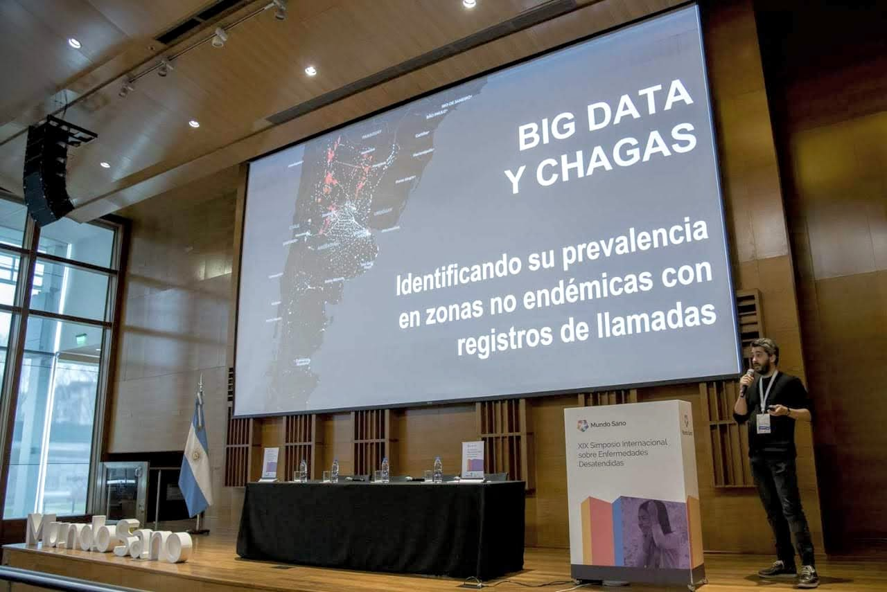
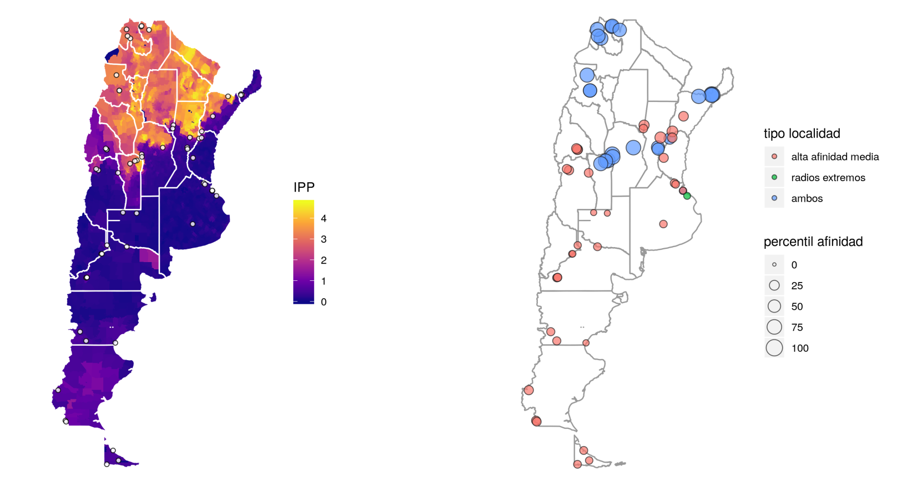

This interdisciplinary project combined the analysis of **billions of anonymized mobile phone call records** with epidemiological, sociodemographic, and healthcare databases. This allowed us to accurately identify areas characterized by high contact of their inhabitants with areas where the Chagas disease is endemic, and which also record a high level of socioeconomic and healthcare vulnerability.

The key to the results is that they allow for the identification of urban or rural areas where it is a priority to take healthcare actions and, as they are outside the endemic zone of the disease, they may not be considered as focal points of attention.

The process and results were presented at various national and international conferences, such as the [2019 World Wide Web Conference](https://dl.acm.org/doi/10.1145/3308560.3316485) (San Francisco, USA), [Data for Policy - 4th International Conference](http://dataforpolicy.org/) (London, UK), the [National Chagas Meeting](https://www.paho.org/arg/index.php?option=com_content&view=article&id=10343:encuentro-nacional-de-chagas-argentina-actualiza-estrategia-para-lograr-la-eliminacion-de-la-transmision&Itemid=226) (Buenos Aires, Argentina), and the [XIX International Symposium on Neglected Diseases](https://www.mundosano.org/simposio/) (Buenos Aires, Argentina).

Selected media coverage:

* ["Interview with Antonio Vázquez Brust, with Nora Bär"](https://radiocut.fm/audiocut/entrevista-a-antonio-vazquez-brust-con-nora-bar/)

* ["The impact of big data on medical practice will be seen in the next 5 to 10 years"](https://www.clarin.com/buena-vida/big-data-ia-proximos-10-anos-diagnosticos-rapidos-precisos-_0_5t-CIr6TL.html)

* [(Interview) "Antonio Vazquez Brust, leader of the Chagas Map project"](https://radiocut.fm/audiocut/antonio-vazquez-brust-lider-del-proyecto-del-mapa-de-chagas/)

* ["Chagas disease: how the situation in Argentina is being mapped"](https://tn.com.ar/salud/lo-ultimo/mal-de-chagas-como-se-construye-el-mapa-con-la-situacion-en-argentina_893988)

* ["Development begins for a map of Chagas disease in Argentina"](http://www.radionacional.com.ar/comienzan-a-desarrollar-un-mapa-de-chagas-de-argentina/)

* ["Big Data will be used to detect where Chagas hides"](https://www.lavoz.com.ar/ciudadanos/usaran-big-data-para-detectar-donde-se-esconde-el-chagas)
