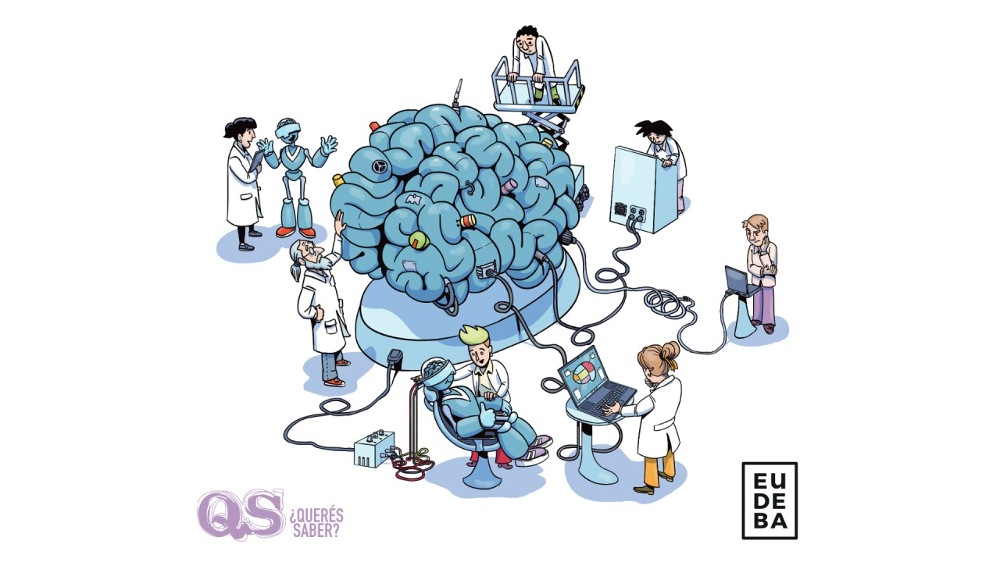
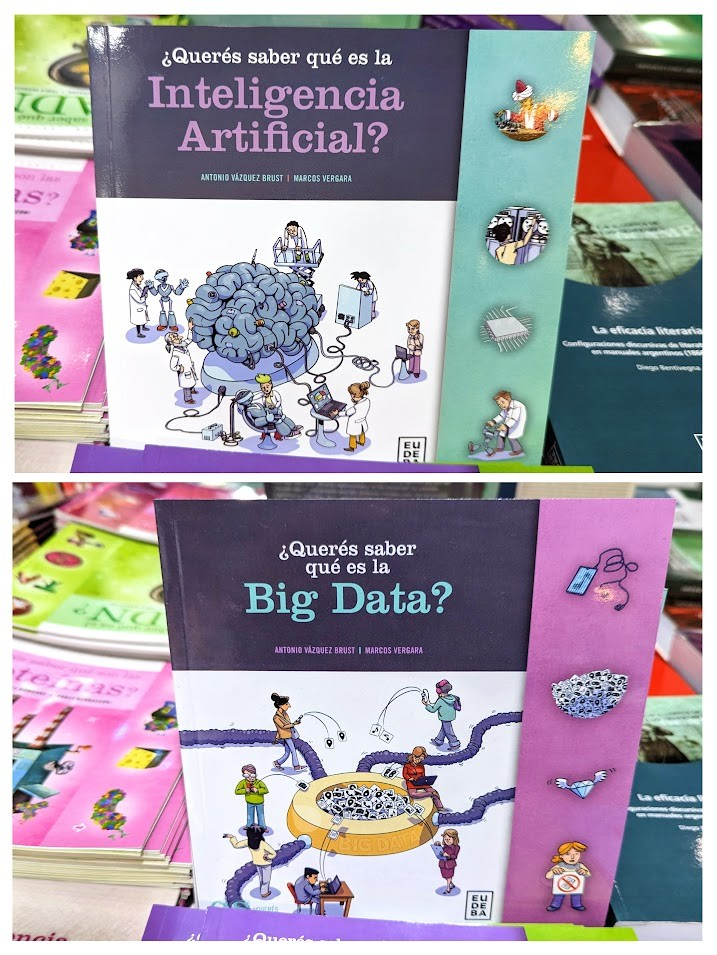
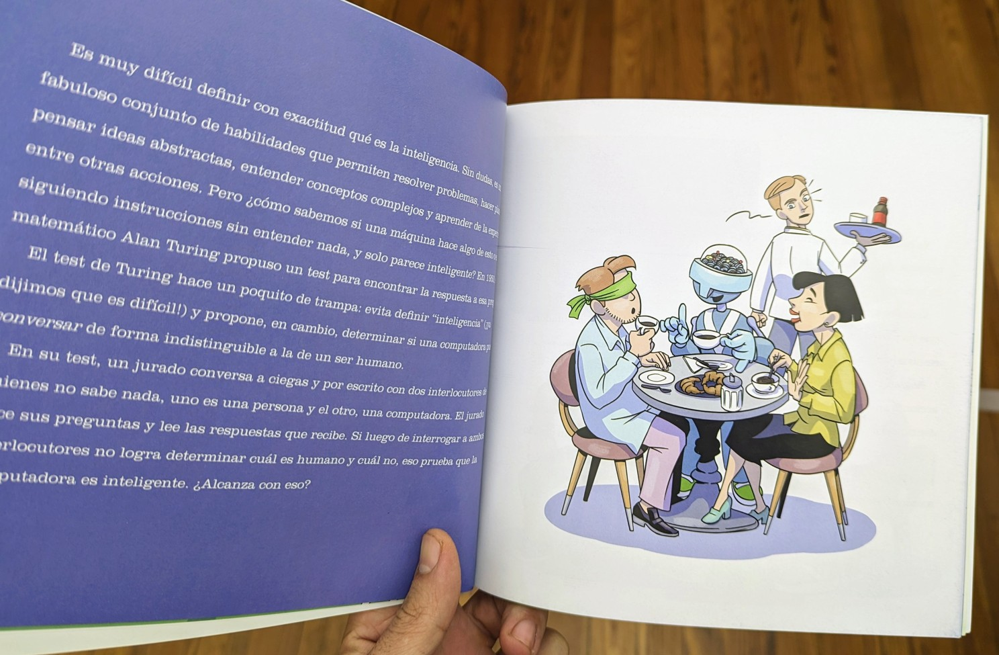
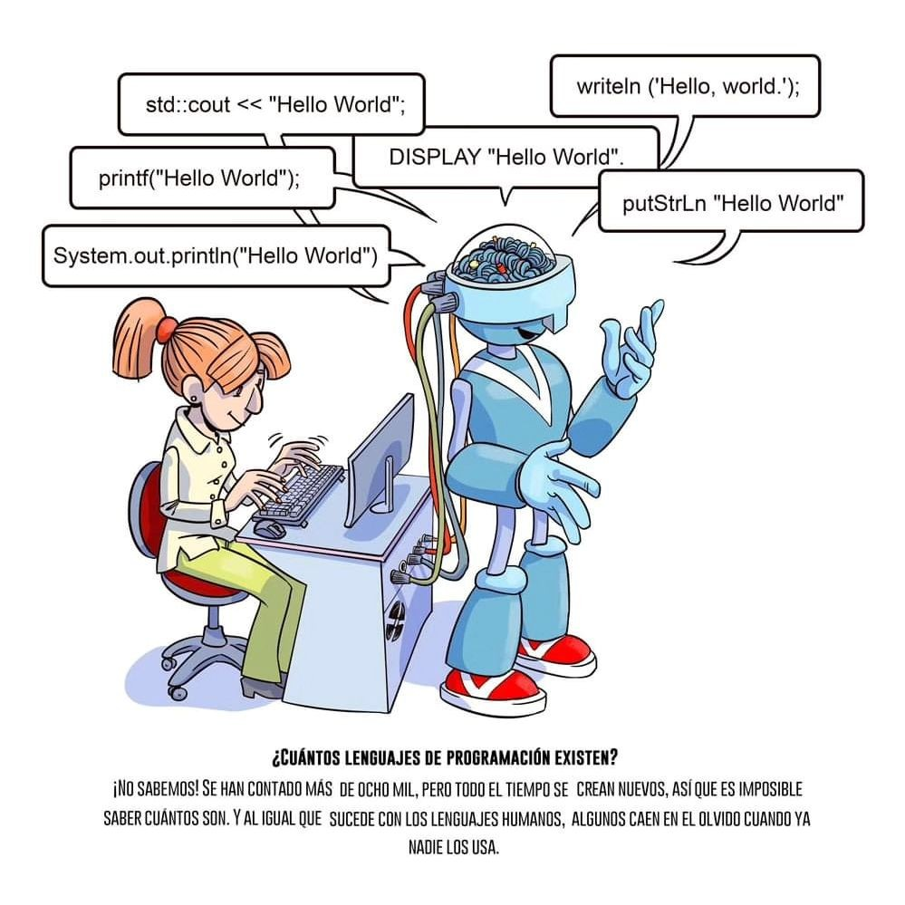
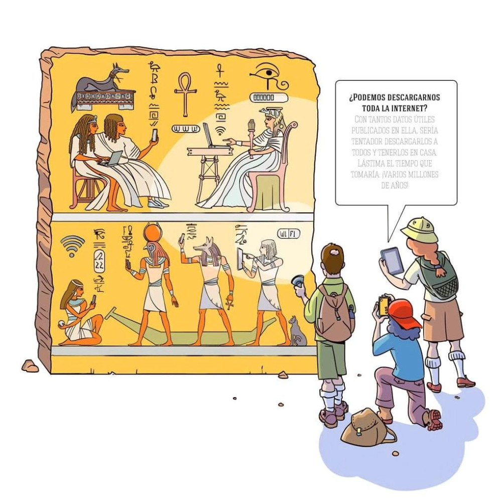

As a child, I was a fan of science and technology popularization books (but only if they had amazing illustrations, mind you). So, I was eager to make my contribution to the genre, on topics that are now central to my profession.

I wrote these two books imagining what I would want to know if I were a kid today: 

[_Do You Want to Know... What is Artificial Intelligence?_](https://www.eudeba.com.ar/Papel/9789502333380/%c2%bfQuer%c3%a9s+saber+qu%c3%a9+es+la+inteligencia+artificial) and [_Do You Want to Know... What is Big Data?_](https://www.eudeba.com.ar/Papel/9789502333397/%c2%bfQuer%c3%a9s+saber+qu%c3%a9+es+la+Big+Data)
(Only available in Spanish for now)

They were illustrated by [Marcos Vergara](https://www.instagram.com/marcosvergaralr/), so they turned out beautiful (thank goodness - the kid I was would have deigned to read them). His clear line and sense of humor were just the complement the texts needed.

_Easter eggs included :)_

The books are are intended a broad audience, from elementary school students to adults who want a very pleasant introduction to the subject. 

