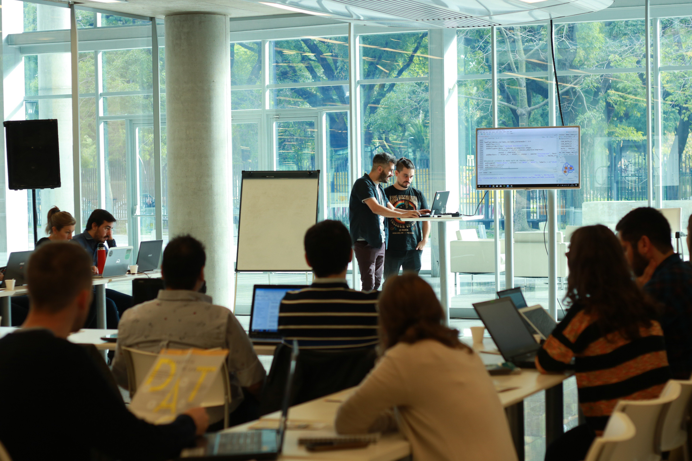

Hired by the Buenos Aires City Government, I designed the Data Science and Public Policy to address the growing need for governments to develop new capabilities in their employees. The goal was to provide teams from different government areas with data analysis skill to enable evidence-based decision-making.

#### Topics:

* Big Data and the City. Definitions, case analysis, future. New data sources, new roles in urban planning.
* Introduction to R, the environment for analyzing, modeling, visualizing, and communicating with data. Guidelines and definition of teams and datasets for the group integrative project.
* Exploratory analysis. Data wrangling: cleaning and organizing found data.
* Fundamental techniques for data transformation. Data source merging.
* Data visualization. Principles of information design. How to choose and execute the appropriate visualization for each type of analysis.
* Data clinic: presentation of preliminary results of each group's projects, discussion on the particular challenges of each dataset, identification of appropriate techniques.
* Predictive and descriptive models. Effect analysis. Simple linear regression. Multiple linear regression.
* Geographic information and maps. Georeferenced data and management of geospatial files.
* Visualizing geographic information. Generating maps with multiple layers and geometries.
* Final grades! Presenting student projects. Lessons learned, next steps.

#### Results:

After completing the course, an event was held at the auditorium of the central headquarters of the Government of the Autonomous City of Buenos Aires. Participants presented the results of their integrative project to their peers and guests from various areas.

Selected student projects, analyzing issues from their government areas: (in Spanish)

* [Analysis of territorial transformations and land use in the City of Buenos Aires between 2008 and 2017](https://datosgcba.github.io/curso-datos/trabajos/rus.html)
* [Study of attendance at public theaters in the City of Buenos Aires](https://datosgcba.github.io/curso-datos/trabajos/asistentes_ctba.html)
* [Impact of weather on the use of the subway system in the City of Buenos Aires](https://datosgcba.github.io/curso-datos/trabajos/subte_clima.html)
* [How much carbon does the public tree canopy of the City of Buenos Aires capture?](https://datosgcba.github.io/curso-datos/trabajos/arboles_carbono.html)
