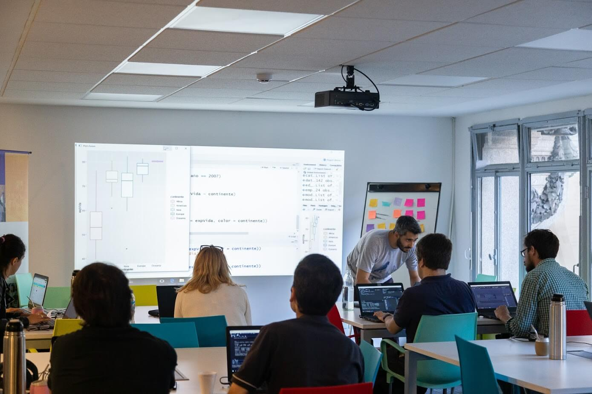
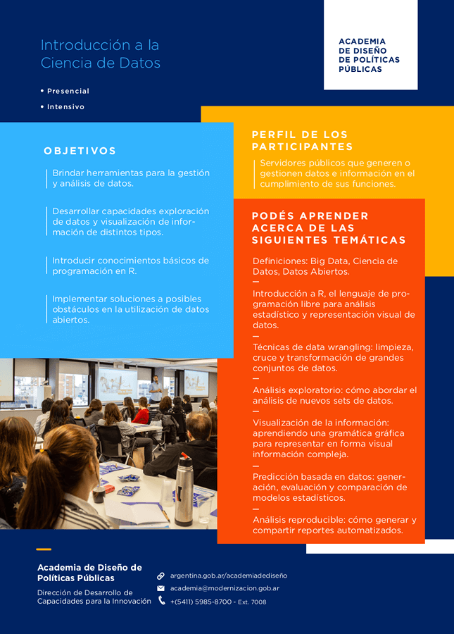

In 2019 I designed a training program based on the requirements of the Capacity Development for Innovation Directorate of the Ministry of Modernization of Argentina.

The training consisted of three practice-focused seminars. An introductory one on data science, which taught programming principles and analytics using R, the language for data analysis and visualization. Building on the knowledge acquired in the initial course, two specialization seminars allowed for a deeper understanding in key areas: one focused on statistical analysis and machine learning, and the other on spatial information analysis and visualization.



I taught the course to more than 30 public officials from various agencies and ministries of the national government of Argentina.

