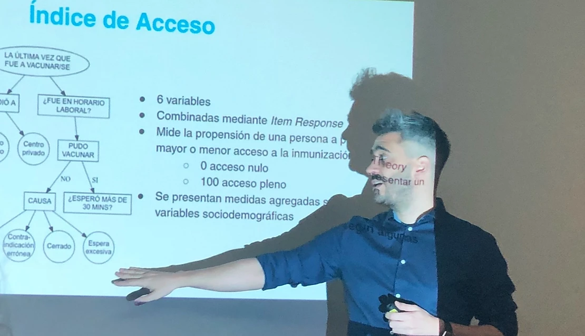
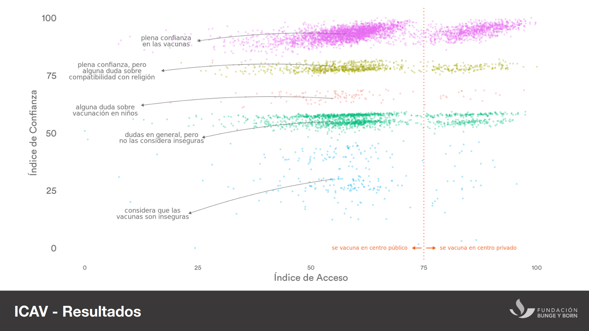
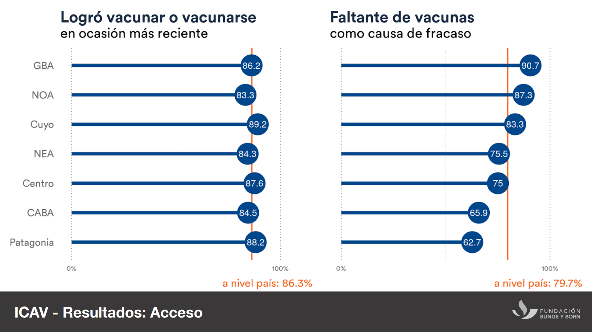

As a Research Fellow at the Bunge and Born Foundation, I helped develop the Index of Confidence and Access to Vaccines (ICAV). The index was designed to identify barriers that hinder access to vaccination, as well as changes in public confidence regarding the importance, safety, and efficacy of vaccines.

Since 2019, the Bunge and Born Foundation has been conducting the ICAV, a project to study and measure the causes of the wide gap between the optimal level of vaccination and the rates achieved in Argentina. The objective of the Index is to contribute to the design of immunization programs and strategies within the framework of public health policies.

Following a national campaign of telephone surveys that reached 7,000 responses, in 2019 we found that the population's trust in vaccines is high: 95.8% consider them safe, 95.47% believe they are important for children, and 93.69% consider them effective.

On the other hand, we detected serious access problems: we estimate that around 13% of those who attempted to get vaccinated or vaccinate minors under their care failed in their last attempt. The main reported cause by respondents was the shortage of vaccines, especially among those who have children under their care.

The ICAV project is still underway, presenting yearly updates that track the evolution og public perception on vaccines.

#### Selected media Coverage: (in Spanish)

* ["Study: 13% of the population could not get vaccinated when they tried"](https://www.ambito.com/informacion-general/vacunas/estudio-un-13-la-poblacion-no-pudo-vacunarse-cuando-lo-intento-n5045729)
* ["Paradoxes in Measles times: 96% of Argentinians believe it's safe to get vaccinated, but 13% couldn't do it due to access problems"](https://www.infobae.com/salud/2019/12/16/paradojas-en-tiempos-de-sarampion-el-96-de-los-argentinos-cree-que-es-seguro-vacunarse-pero-el-13-no-pudo-hacerlo-por-problemas-en-el-acceso/)
* ["The Bunge and Born Foundation Report: How was it made"](https://www.pagina12.com.ar/209560-como-se-hizo-el-estudio)
* ["13% of Argentinians failed to get vaccinated or vaccinate minors under their care the last time they tried to do so"](https://www.diarioprensa.com.ar/13-de-los-argentinos-no-logro-vacunarse-o-vacunar-a-los-menores-a-su-cargo-la-ultima-vez-que-intento-hacerlo/)
* ["Despite the 'anti-vaxxers', a local index estimates that 96% of Argentinians find vaccines reliable"](https://www.clarin.com/sociedad/pese-antivacunas-indice-local-estima-96-argentinos-considera-confiables_0_j6WyRxDdc.html)

