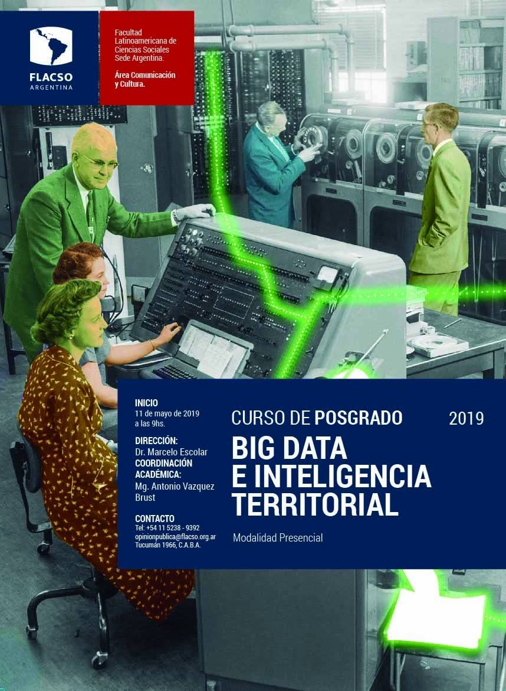
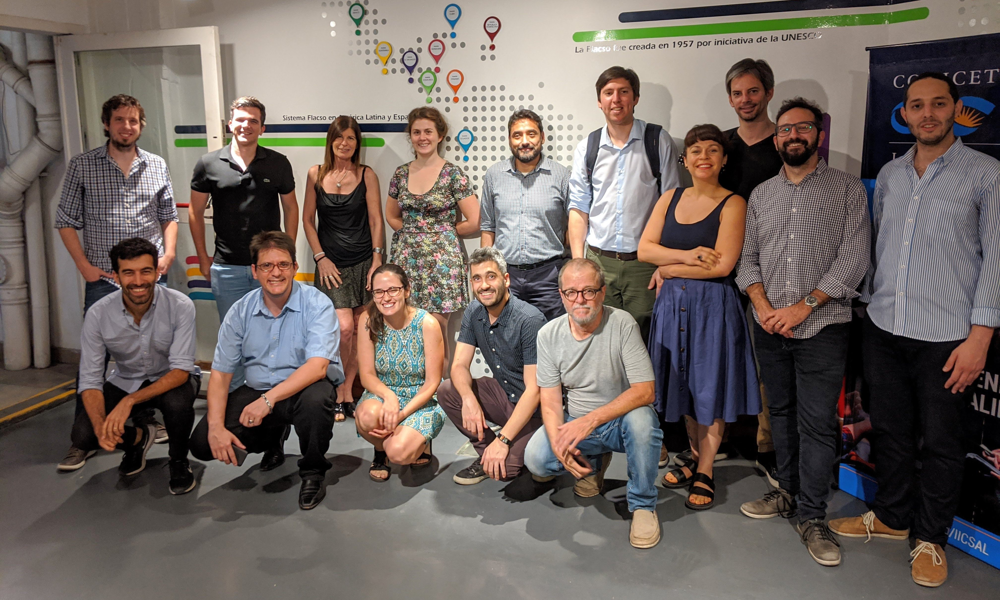

The postgraduate course in Big Data and Territorial Intelligence at the Latin American Faculty of Social Sciences (FLACSO) teaches principles of computational statistics, programming, and Geographic Information Systems (GIS) alongside the theoretical framework for their application in territorial management.

I designed the curriculum for the course and acted as its academic coordinator, plus professor in Geographic Data Science, for its first three years.

The curse, still offered, teaches students how to use spatial analysis and data science to tackle complex geography-related problems. Students acquire the ability to confidently combine analytical, conceptual, and computational skills.

 
(part of) the inaugural cohort, 2019
