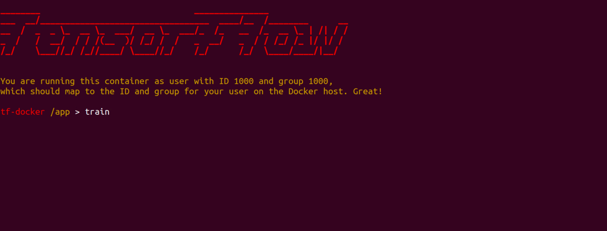
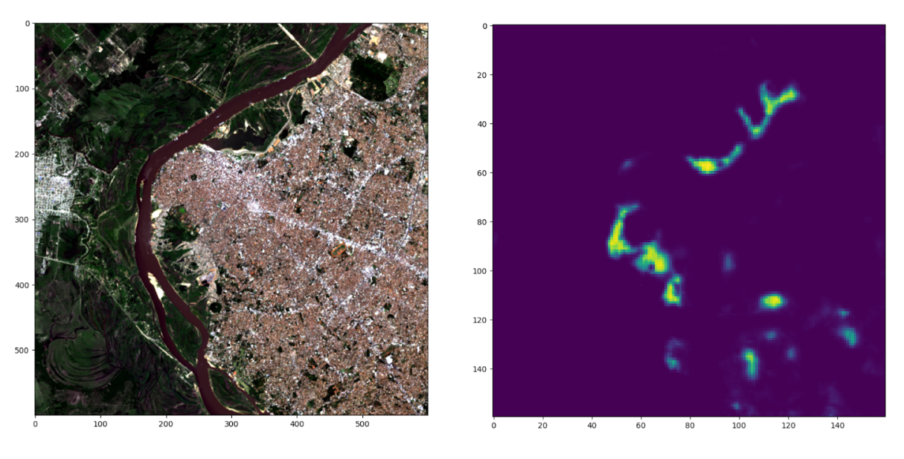

MAIIA is a collection of algorithms that enable automated mapping of informal urban settlements through the analysis of satellite images. To facilitate its implementation, it is distributed as a pre-configured operating system image (via [Docker](https://www.docker.com/)) and alternatively as a set of Python notebooks, providing scripts that can train a detection model and apply it to new images in just two steps.

I led the development of the MAIIA algorithms thanks to the support of the Housing and Urban Development Division of the Inter-American Development Bank. The tool was originally developed as part of a technical assistance program for the National Planning Department of Colombia, in order to provide the institution with a tool to produce and update precise maps with the location and extent of informal settlements in Colombian cities.

MAIIA leverages open-source technologies such as [Unetseg](https://github.com/dymaxionlabs/unetseg), [Tensorflow](https://www.tensorflow.org/) (current version) and [Raster Vision](https://rastervision.io/), [PyTorch](https://pytorch.org/) (v2, in development).

The tool was developed with an emphasis on its ease of implementation, to lower access barriers to artificial intelligence tools and allow government agencies, researchers, and other  stakeholders to apply it to their own use cases.

#### Application example

From 2021 to 2023, the Inter-American Development Bank assisted the National Ministry of Urbanism in Paraguay in developing a cost-effective methodology to maintain updated records of the country's urban informal settlements and the living conditions within them.

MAIIA was a crucial component of this project as it can be fed with publicly available and free satellite images, enabling the survey of any area at a small fraction of the cost of a traditional on-the-ground survey effort.

We piloted this technology in the Metropolitan Area of Asunción, the largest and most densely populated city in Paraguay. After being trained with examples of local settlements, the MAIIA algorithm learned to identify them in images and was able to identify more than 95% of the already known informal areas. Even more importantly, it located many new ones.

MAIIA's output guided the follow-up field work, as the areas identified as informal settlements by the algorithm were visited by census-takers that interviewed residents and [obtained a clear picture of their needs](https://www.muvh.gov.py/blog/2024/presentan-estudios-y-herramientas-de-visibilizacion-de-comunidades-vulnerables-del-ama.html).

I explain the technology behind this project in the "Neighborhoods, Big Data and AI" episode of _Urban Intelligence_, the official podcast from the IDB Cities Lab.

<iframe style="border-radius:12px" src="https://open.spotify.com/embed/episode/34jiJSdCY9YG5yUWmbbU1y?utm_source=generator&theme=0" width="100%" height="352" frameBorder="0" allowfullscreen="" allow="autoplay; clipboard-write; encrypted-media; fullscreen; picture-in-picture" loading="lazy"></iframe>