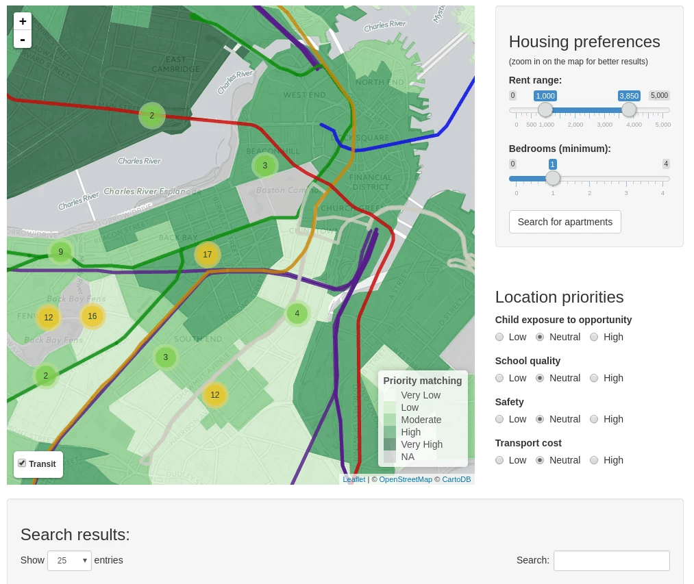

I collaborated as a data scientist with The American City Coalition, an NGO in Boston that develops strategies for revitalizing neighborhoods where vulnerable populations reside. 

I was responsible for the large-scale collection and analysis of geospatial and demographic data to assess the effectiveness of policies aimed at racial desegregation based on access to public housing in the state of Massachusetts, USA.

