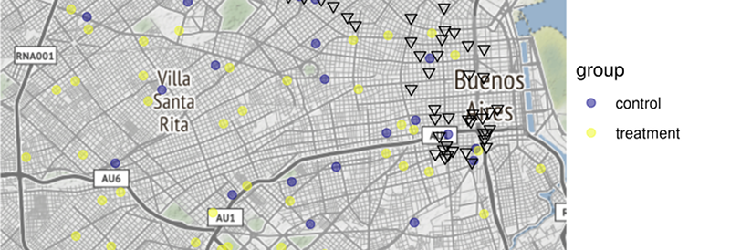
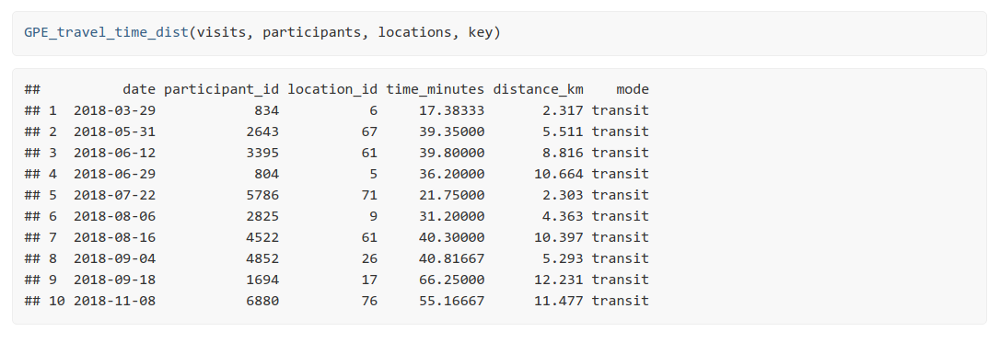
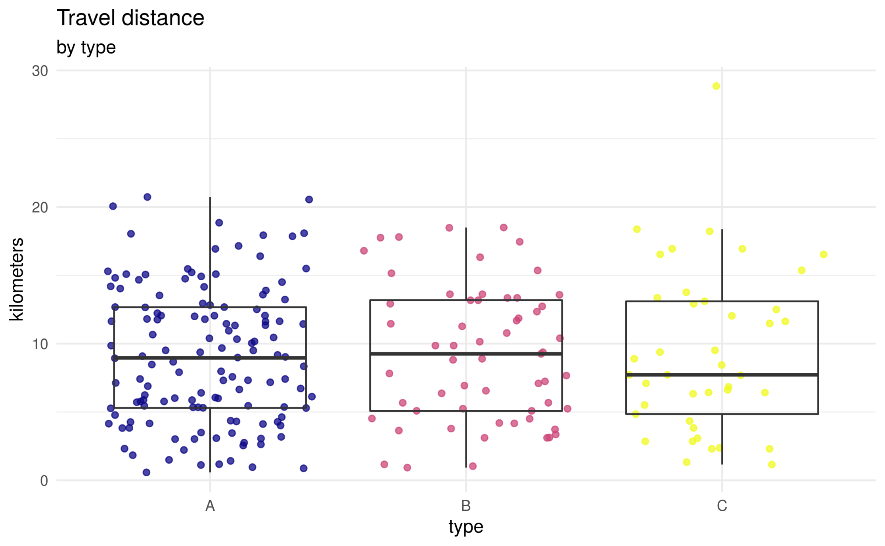

GPE (short for "Geo-referenced Program Evaluation") is a package of functions for the R programming language. It was designed to make life easier for those analyzing movement dynamics in urban contexts.

For example, to measure the impact of social programs where access metrics (distances and travel times, places visited, etc.) are of interest. I originally developed the set of functions that now make up GPE to assist the Inter-American Development Bank (IDB) and the Buenos Aires City Government in [evaluating the City's Cultural Pass Program](https://blogs.iadb.org/ciudades-sostenibles/en/behind-the-scenes-big-data-analysis-for-public-policy/), an initiative to encourage access to cultural offerings (music, film, literature, etc.) among young people of all backgrounds.

GPE is now part of the Code for Development catalog, the IDB's open-source software initiative that encourages governments and citizens to open up, share, and reuse digital tools that address public policy challenges.

The package includes functions that will allow the user to study various aspects of consumer or beneficiary behavior, including:

* Georeference postal addresses (converting street name and number to latitude and longitude points)

* Obtain base maps of any city’s urban grid and visualize overlaid projections of the distance traveled (between participants’ homes and points of service accessed, for example)

* Estimate a matrix of distances between sites accessed and consumer/beneficiary origin

* Calculate metrics of frequency, distribution by group, and distance travelled by consumers/beneficiaries to points of sale/access

* Create visualizations that explore the difference between frequency and type of consumption by consumer/beneficiary attribute (depending on the information available: socioeconomic status, length of program participation, type of program participation, etc)

