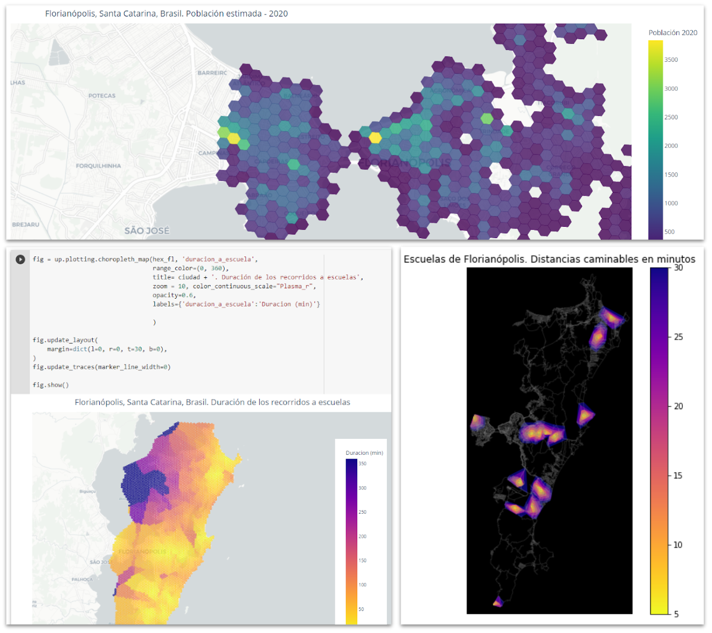
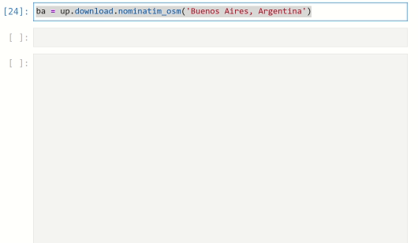
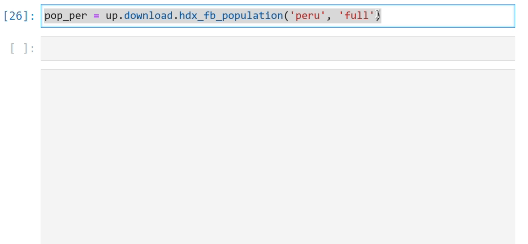
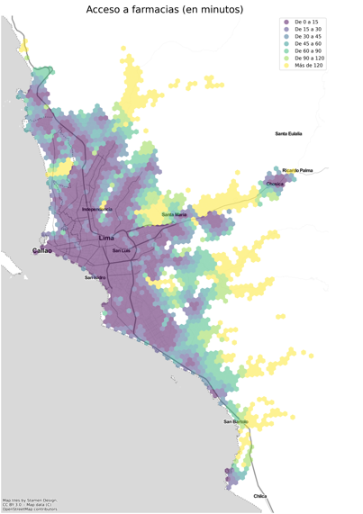
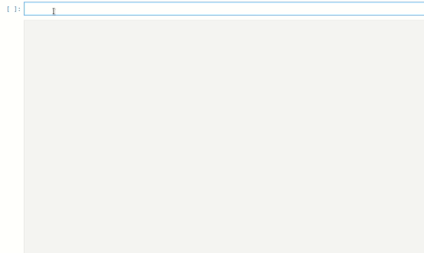

UrbanPy is an open-source Python library that automates the entire workflow required to obtain geographic boundaries of a city, estimate its population, locate places of interest, and even calculate travel times through the local street network. 

UrbanPy is particularly useful for estimating accessibility indices—i.e., where people live farthest away from key resources and services such as schools, hospitals, bus stops, places to buy food, and so on.

I prototyped and led its development, thanks to the support of the Inter-American Development Bank.

#### Why was it developed?

In the context of the COVID-19 pandemic, measuring and correcting accessibility problems, especially to health services, was urgent. The pandemic had forced metropolitan governments in Latin America and the Caribbean to make immediate decisions to plan the distribution of care at the intra-urban level. With this it become essential to understand where those residents with most urgent needs were located, and where the deployment of government services, provision of medicine, financial aid, and so on was most needed.

Listening to the needs of different municipalities, at the IDB's Urban Development and Housing Division we developed a set of mapping techniques and tools with high spatial resolution, combining data on population density and location of key points of interest (pharmacies, hospitals, banks, schools, etc.). This produced detailed accessibility metrics and heat maps indicating the degree of insulation for each sector. What was learned was poured into UrbanPy. 

To develop a high-quality library we enlisted the assistance of a team of engineers from Universidad del Pacífico (Peru). [Claudio Ortega](https://github.com/Claudio9701), a member of that team, came up with the library's name and also became its main maintainer from then on.

#### What can you do with UrbanPy?

UrbanPy allows you to download cartography of any city

It also allows access to current population estimates, with high spatial resolution and global coverage
 

With UrbanPy you can automatically download and map points of interest (pharmacies, banks, schools, transport stations, etc.) and estimate travel distance from each area of the city to the closest service point 

And it generates interactive applications to explore the maps in detail.

#### Application example

The Inter-American Development Bank teamed up with GitHub to assist Pará, a state of Brazil with more than 8 million inhabitants, in identifying the most strategic locations for its future public schools. 

We explain the project here:



