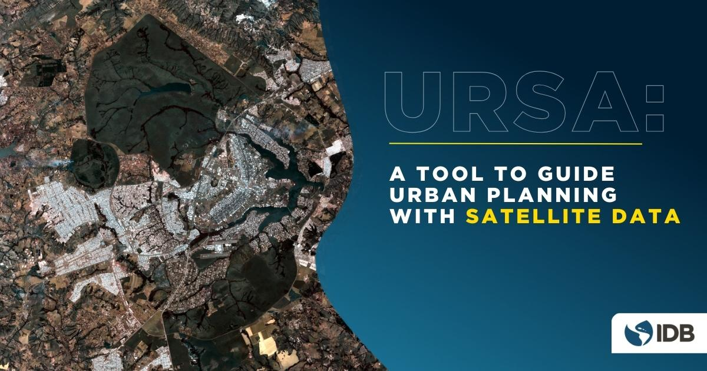
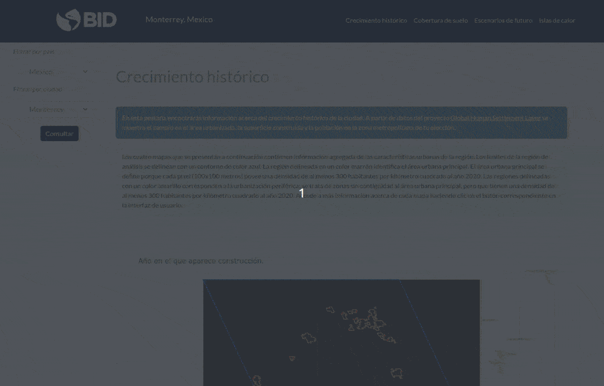
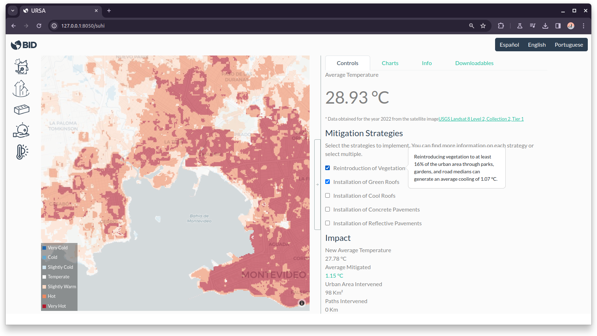

Open data, in general, and data obtained through satellite records, in particular, offer countless uses for urban planning.

These data not only revolutionize the ability to study our metropolitan areas but can also drive more informed and strategic decision-making for sustainable urban development. Yet, there remains a significant obstacle that limits access to these resources: technical complexity, which imposes the need for specialized personnel and equipment often beyond the reach of local governments.

I conceived URSA (_Urban Reporting based on Satellite Analysis_) as an open source application designed to bridge this gap. This tool was developed from the [IDB Cities Lab](https://blogs.iadb.org/ciudades-sostenibles/en/category/emerging-cities-latin-america-caribbean/idb-cities-lab/) with scientific and technical support from the [Center for the Future of Cities](https://futurociudades.tec.mx/) at the Monterrey Institute of Technology.

URSA is multi-platform desktop application that provides easy access to the vast amount of information captured by satellite sensors, as it collects, processes, and presents key information about the evolution of cities in Latin America and the Caribbean. 

It can measure the evolution of metropolitan areas by accessing historical records of satellite images that document the expansion of urban areas over time.

It also identifies with high spatial precision the presence of urban heat islands, inhabited areas where daytime temperatures are higher than in surrounding areas due, among other causes, to the lack of green spaces and the characteristics of buildings.

URSA's functions are not limited to measuring current data. It also allows comparing scenarios of future growth through simulation of an agent-based model. The estimated scenarios include "inertial" - where the city continues to consume surrounding land at the historical rate - the "controlled" scenario - growing inward, halting sprawl - and lastly, an "accelerated" scenario to estimate the results of an increasing growth rate.

While the scenarios for each city are calibrated based on historical information, they are not necessarily an exact prediction of what will happen -of course!. They are intended as prospective and exploratory exercise to inspire decision-making.

#### Selected media coverage: (in Spanish)

- [Heat islands: These are the corners of Buenos Aires where the temperature is hellish](https://www.lanacion.com.ar/sociedad/islas-de-calor-portenas-tenes-calor-entonces-ni-te-asomes-a-estas-esquinas-portenas-donde-la-nid06022024/#/)

- [Mapping heat in Buenos Aires](https://www.redaccion.com.ar/el-mapa-del-calor-en-buenos-aires-cuales-son-las-zonas-mas-frescas-de-la-ciudad-y-por-que)

- [Heat islands: What are the hottest spots in Montevideo?](https://www.teledoce.com/telemundo/ciencia-y-tecnologia/islas-de-calor-cuales-son-los-puntos-mas-calientes-de-montevideo/)

- "Urban heat islands" | What are the hottest areas in Buenos Aires city?

